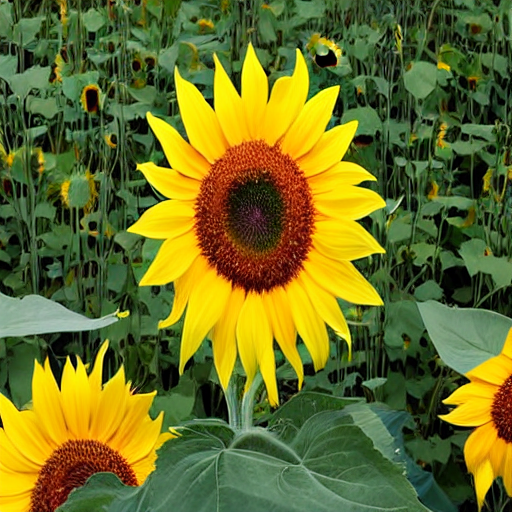
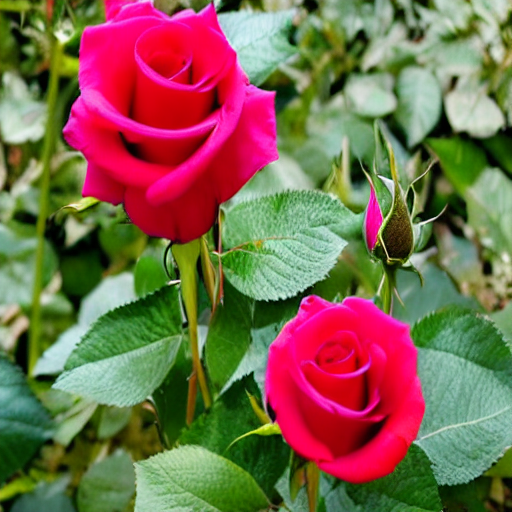
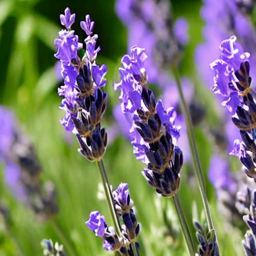

# text-to-image-generator
Real-time text-to-image generation using Fine-tuned Stable Diffusion, CGAN and Attention GAN built on Oxford-102 Flowers.

# 🌸 Real-Time Text-to-Image Generator

[](https://python.org)
[](https://pytorch.org)
[](https://huggingface.co/docs/diffusers)
[](https://colab.research.google.com/drive/15MR-_gOiKi_0rdlCEpoo3FJIqMv9nb0k)

## 🔗 Links

| | Link |
|--|------|
| 📓 Notebook | [](https://colab.research.google.com/drive/15MR-_gOiKi_0rdlCEpoo3FJIqMv9nb0k) |
| 🤗 Live Demo | [](https://huggingface.co/spaces/Pritish23/text-to-image-generator) |
| 🧠 LoRA Model | [](https://huggingface.co/Pritish23/flower-lora-weights) |
| 💻 GitHub | [](https://github.com/Pritish-23/text-to-image-generator) |

A comprehensive text-to-image generation pipeline built from
scratch using Fine-tuned Stable Diffusion (LoRA), Conditional
GAN, and Attention-enhanced GAN on the Oxford-102 Flowers dataset.

---

## 🎯 Project Overview

This project implements a complete text-to-image generation
system that routes prompts to the most suitable model:

- **Flower prompts** → Fine-tuned Stable Diffusion v1.5 (LoRA)
- **Shape prompts**  → Conditional GAN or Attention GAN

---

## 🖼️ Sample Results

### Fine-tuned Stable Diffusion
| Sunflower | Rose | Lotus | Hibiscus |
|-----------|------|-------|---------|
|  |  |  |  |

---

## 🏗️ Architecture
```
Text Prompt
↓
CLIP Text Encoder (512-dim embedding)
↓
Prompt Router
↓
┌────────────────────────────────────┐
│  Flower prompt → Fine-tuned SD     │
│  Shape prompt  → CGAN              │
│  Detailed shape→ Attention GAN     │
└────────────────────────────────────┘
↓
Generated Image
↓
CLIP Score Evaluation
```

## 📚 Project Structure
```
text-to-image-generator/
│
├── README.md
├── requirements.txt
├── notebooks/
│   ├── text_to_image_generator_project.ipynb
├── outputs/
│   ├── sample_images/
│   └── plots/
```
## 🔧 Tasks Completed

| Task | Description | Status |
|------|-------------|--------|
| Task 1 | Dataset loading & exploration (Oxford-102) | ✅ |
| Task 2 | Text preprocessing & CLIP embeddings | ✅ |
| Task 3 | Conditional GAN from scratch | ✅ |
| Task 4 | Attention-enhanced GAN | ✅ |
| Task 5 | Fine-tune Stable Diffusion (LoRA) | ✅ |
| Task 6 | Full end-to-end pipeline | ✅ |

---

## 🧠 Models Built

### 1. Conditional GAN (CGAN)
- Built from scratch using PyTorch
- Generator: 5-layer transposed convolution network
- Discriminator: 5-layer convolution network
- Trained on 10,000 custom shape images
- Generates circles, squares and triangles

### 2. Attention-Enhanced GAN
- Extends CGAN with self-attention and cross-attention
- Self-attention at 16×16 resolution
- Cross-attention at 32×32 resolution
- More stable training via label smoothing
- Better shape coherence and conditioning

### 3. Fine-tuned Stable Diffusion (LoRA)
- Base model: Stable Diffusion v1.5
- Fine-tuning method: LoRA (r=16, alpha=32)
- Dataset: Oxford-102 Flowers (1,020 training images)
- Epochs: 10
- Only 0.18% of parameters trained

---

## 📊 Results

### CLIP Score Evaluation
| Model | Mean CLIP Score | Quality |
|-------|----------------|---------|
| Fine-tuned SD | 0.315 | Excellent ⭐ |
| CGAN | 0.247 | Acceptable ✓ |
| Attention GAN | 0.241 | Acceptable ✓ |
| **Pipeline Average** | **0.293** | **Good ✓** |

### Dataset Statistics
| Metric | Value |
|--------|-------|
| Total images | 8,189 |
| Total classes | 102 |
| Avg image size | 636×540 px |
| Avg aspect ratio | 1.22 |
| Red channel mean | 0.434 |
| Green channel mean | 0.382 |
| Blue channel mean | 0.300 |

---

## 🚀 How to Run

### Option 1 — Google Colab (Recommended)

1. Open the notebook in Google Colab
2. Enable GPU: Runtime → Change runtime type → T4 GPU
3. Run cells in order

Link for the Colab File: https://colab.research.google.com/drive/15MR-_gOiKi_0rdlCEpoo3FJIqMv9nb0k?usp=sharing

### Option 2 — Local Setup
```bash
# Clone the repo
git clone https://github.com/Pritish-23/text-to-image-generator
cd text-to-image-generator

# Install dependencies
pip install -r requirements.txt

# Run Gradio demo
python demo.py
```

### Option 3 — Live Demo (No setup required)

[](https://huggingface.co/spaces/Pritish23/text-to-image-generator)

Try it instantly at:
[pritish23-text-to-image-generator.hf.space](https://pritish23-text-to-image-generator.hf.space)

---

## 📦 Requirements
```
torch>=2.0.0
torchvision>=0.15.0
diffusers>=0.21.0
transformers>=4.30.0
peft>=0.5.0
accelerate>=0.21.0
gradio>=3.40.0
opencv-python>=4.8.0
matplotlib>=3.7.0
seaborn>=0.12.0
scikit-learn>=1.3.0
Pillow>=10.0.0
numpy>=1.24.0
```
---

## 🛠️ Technologies Used

| Category | Tools |
|----------|-------|
| Deep Learning | PyTorch, Diffusers |
| Fine-tuning | PEFT (LoRA) |
| Text Understanding | CLIP, Transformers |
| Image Processing | OpenCV, Pillow |
| Visualization | Matplotlib, Seaborn, t-SNE |
| UI | Gradio |
| Dataset | Oxford-102 Flowers, Custom Shapes |

---

## 📈 Training Details

### CGAN Training
- Dataset: 10,000 custom shape images
- Epochs: 100
- Batch size: 64
- Learning rate: 0.0002
- Optimizer: Adam (β=0.5, 0.999)

### Attention GAN Training
- Same setup as CGAN
- Added: label smoothing (0.9)
- Added: 2× discriminator updates
- Added: self + cross attention layers

### LoRA Fine-tuning
- Base: Stable Diffusion v1.5
- Rank: r=16, alpha=32
- Target layers: to_q, to_k, to_v, to_out
- Learning rate: 1e-4
- Epochs: 10
- Batch size: 1

---

## 👤 Author

**Pritish Sharma**
- B.Sc. Data Science
- GitHub: https://github.com/Pritish-23 
- LinkedIn: https://www.linkedin.com/in/pritishsharma230805/ 

---

## 🙏 Acknowledgements

- [Oxford 102 Flowers Dataset](https://www.robots.ox.ac.uk/~vgg/data/flowers/102/)
- [Stable Diffusion v1.5](https://huggingface.co/runwayml/stable-diffusion-v1-5)
- [Hugging Face Diffusers](https://github.com/huggingface/diffusers)
- [CLIP by OpenAI](https://github.com/openai/CLIP)
